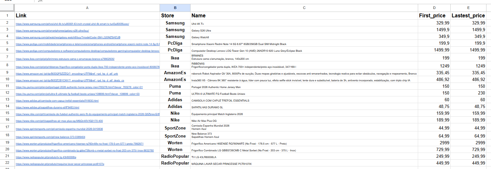
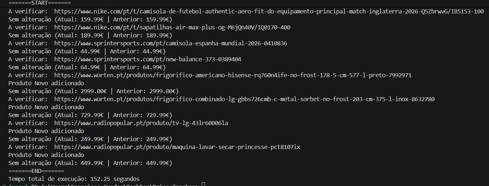

# Price Tracker

Sistema automatizado para **monitorização de preços de produtos online**.

O projeto verifica automaticamente os preços de produtos em várias lojas online, guarda os valores num **Google Sheets** e envia **alertas por email quando o preço baixa**.

Utiliza **Playwright para scraping**, **Google Sheets API para armazenamento** e **SMTP para envio de emails**.

---

# Funcionalidades

* Monitorização automática de preços
* Scraping de várias lojas online
* Armazenamento dos preços num Google Sheets
* Deteção de descida de preços
* Envio automático de alertas por email
* Suporte para várias lojas

### Lojas suportadas

* Worten
* Amazon
* Nike
* Adidas
* Puma
* IKEA
* PcDiga
* Samsung
* Radio Popular
* Sport Zone

---

# Exemplo da folha Google Sheets

Os produtos a monitorizar são definidos numa folha Google Sheets.



Estrutura da folha:

| Coluna        | Descrição                |
| ------------- | ------------------------ |
| Link          | URL do produto           |
| Category      | Categoria do produto     |
| Name          | Nome do produto          |
| First_price   | Primeiro preço registado |
| Lastest_price | Último preço registado   |

---

# Exemplo de alerta por email

Quando o preço de um produto baixa, é enviado automaticamente um email.

Exemplo de mensagem:

```id="k8d4f7"
O produto: Nike Air Max
Baixou de 120.00€ para 95.00€
Link: https://...
```

---

# Execução no terminal

Exemplo de execução do programa:



Exemplo de saída:

```id="r6p3mn"
A verificar: https://www.radiopopular.pt/produto/tv-lg-43lr60006la
Produto Novo adicionado
Sem alteração (Atual: 249.99€ | Anterior: 249.99€)

A verificar: https://www.radiopopular.pt/produto/maquina-lavar-secar-princesse-pct8107ix
Produto Novo adicionado
Sem alteração (Atual: 449.99€ | Anterior: 449.99€)

=======END=======
Tempo total de execução: 152.25 segundos
```

---

# Estrutura do projeto

```id="3z2t8y"
Price_Tracker
│
├── src
│   ├── main.py
│   ├── scraper.py
│   ├── email_sender.py
│   ├── google_apis.py
│   └── play_wright.py
│
├── config
│   └── credentials.json
│
├── Images
│   ├── sheets.png
│   ├── email.png
│   └── Terminal.png
│
├── venv
├── .env
├── .gitignore
├── requirements.txt
└── README.md
```

---

# Instalação

Clonar o repositório:

```id="hz6x8g"
git clone https://github.com/teu-utilizador/price-tracker.git
cd price-tracker
```

Criar ambiente virtual:

```id="b6h2tw"
python -m venv venv
```

Ativar ambiente virtual:

Windows

```id="ue38kq"
venv\Scripts\activate
```

Linux / Mac

```id="0c6t2w"
source venv/bin/activate
```

Instalar dependências:

```id="4u5vkn"
pip install -r requirements.txt
```

Instalar browsers do Playwright:

```id="g8nq5r"
playwright install
```

---

# Variáveis de ambiente

Criar um ficheiro `.env` na raiz do projeto.

Exemplo:

```id="psh3ax"
EMAIL=teu_email@gmail.com
EMAIL_PASSWORD=app_password_gmail
```

⚠️ Deve ser usada uma **App Password do Gmail**.

---

# Configuração Google Sheets

1. Criar um projeto no Google Cloud
2. Ativar:

   * Google Sheets API
   * Google Drive API
3. Criar uma **Service Account**
4. Fazer download do ficheiro de credenciais
5. Colocar em:

```id="8x7y2c"
config/credentials.json
```

6. Partilhar a folha Google Sheets com o email da Service Account.

---

# Executar o programa

```id="4x7b3k"
python src/main.py
```

O programa irá:

1. Ler os links dos produtos no Google Sheets
2. Fazer scraping dos preços
3. Comparar com os preços anteriores
4. Atualizar a folha
5. Enviar email se houver descida de preço

---

# Dependências principais

* playwright
* gspread
* google-auth
* python-dotenv

---

# Melhorias futuras

* Adicionar mais lojas
* Criar histórico de preços
* Criar dashboard web
* Automatizar execução (cron / task scheduler)
* Dockerizar o projeto

---

# Autor

Francisco Guedes
